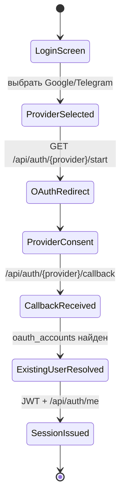

# FR-002 ? Авторизация через OAuth

Simulation artifact based on state diagram from section 6.

## State Diagram

```mermaid
stateDiagram-v2
[*] --> LoginScreen
LoginScreen --> ProviderSelected : выбрать Google/Telegram
ProviderSelected --> OAuthRedirect : GET /api/auth/{provider}/start
OAuthRedirect --> ProviderConsent
ProviderConsent --> CallbackReceived : /api/auth/{provider}/callback
CallbackReceived --> ExistingUserResolved : oauth_accounts найден
ExistingUserResolved --> SessionIssued : JWT + /api/auth/me
SessionIssued --> [*]
```
