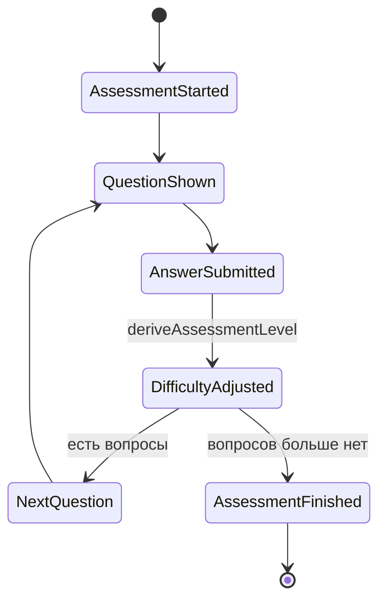

# FR-010 ? Адаптивная оценка уровня

Simulation artifact based on state diagram from section 6.

## State Diagram

```mermaid
stateDiagram-v2
[*] --> AssessmentStarted
AssessmentStarted --> QuestionShown
QuestionShown --> AnswerSubmitted
AnswerSubmitted --> DifficultyAdjusted : deriveAssessmentLevel
DifficultyAdjusted --> NextQuestion : есть вопросы
NextQuestion --> QuestionShown
DifficultyAdjusted --> AssessmentFinished : вопросов больше нет
AssessmentFinished --> [*]
```
