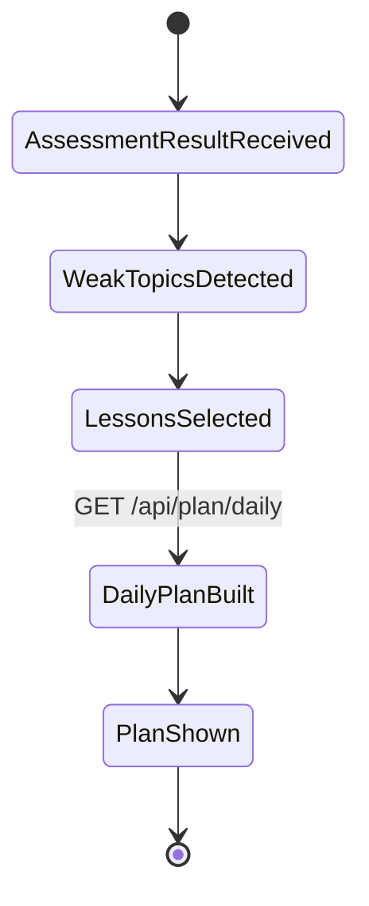

# FR-011 ? Формирование персонального плана

Simulation artifact based on state diagram from section 6.

## State Diagram

```mermaid
stateDiagram-v2
[*] --> AssessmentResultReceived
AssessmentResultReceived --> WeakTopicsDetected
WeakTopicsDetected --> LessonsSelected
LessonsSelected --> DailyPlanBuilt : GET /api/plan/daily
DailyPlanBuilt --> PlanShown
PlanShown --> [*]
```
