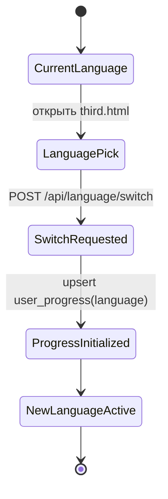

# FR-012 ? Смена изучаемого языка

Simulation artifact based on state diagram from section 6.

## State Diagram

```mermaid
stateDiagram-v2
[*] --> CurrentLanguage
CurrentLanguage --> LanguagePick : открыть third.html
LanguagePick --> SwitchRequested : POST /api/language/switch
SwitchRequested --> ProgressInitialized : upsert user_progress(language)
ProgressInitialized --> NewLanguageActive
NewLanguageActive --> [*]
```
