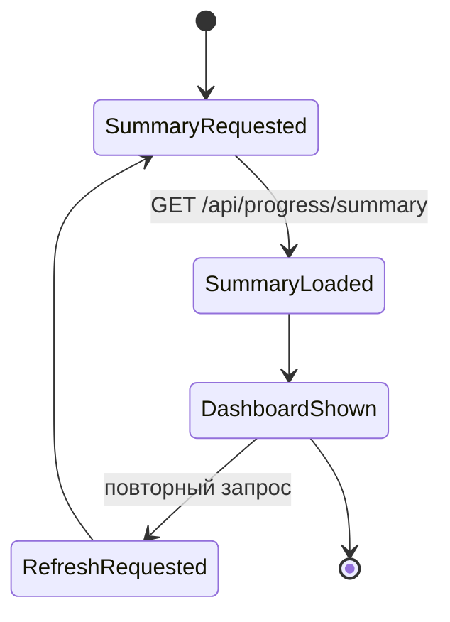

# FR-013 ? Отображение прогресса

Simulation artifact based on state diagram from section 6.

## State Diagram

```mermaid
stateDiagram-v2
[*] --> SummaryRequested
SummaryRequested --> SummaryLoaded : GET /api/progress/summary
SummaryLoaded --> DashboardShown
DashboardShown --> RefreshRequested : повторный запрос
RefreshRequested --> SummaryRequested
DashboardShown --> [*]
```
