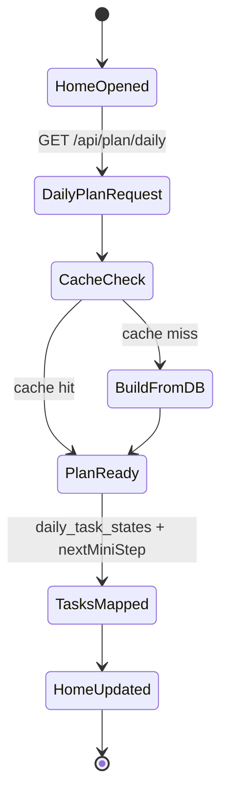

# FR-020 ? Формирование ежедневного урока

Simulation artifact based on state diagram from section 6.

## State Diagram

```mermaid
stateDiagram-v2
[*] --> HomeOpened
HomeOpened --> DailyPlanRequest : GET /api/plan/daily
DailyPlanRequest --> CacheCheck
CacheCheck --> BuildFromDB : cache miss
CacheCheck --> PlanReady : cache hit
BuildFromDB --> PlanReady
PlanReady --> TasksMapped : daily_task_states + nextMiniStep
TasksMapped --> HomeUpdated
HomeUpdated --> [*]
```
