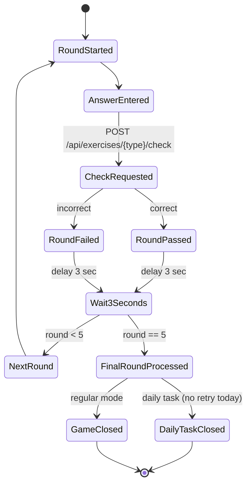

# FR-021 ? Выполнение упражнений разных типов (5 раундов)

Simulation artifact based on state diagram from section 6.

## State Diagram

```mermaid
stateDiagram-v2
[*] --> RoundStarted
RoundStarted --> AnswerEntered
AnswerEntered --> CheckRequested : POST /api/exercises/{type}/check
CheckRequested --> RoundPassed : correct
CheckRequested --> RoundFailed : incorrect
RoundPassed --> Wait3Seconds : delay 3 sec
RoundFailed --> Wait3Seconds : delay 3 sec
Wait3Seconds --> NextRound : round < 5
NextRound --> RoundStarted
Wait3Seconds --> FinalRoundProcessed : round == 5
FinalRoundProcessed --> DailyTaskClosed : daily task (no retry today)
FinalRoundProcessed --> GameClosed : regular mode
DailyTaskClosed --> [*]
GameClosed --> [*]
```
