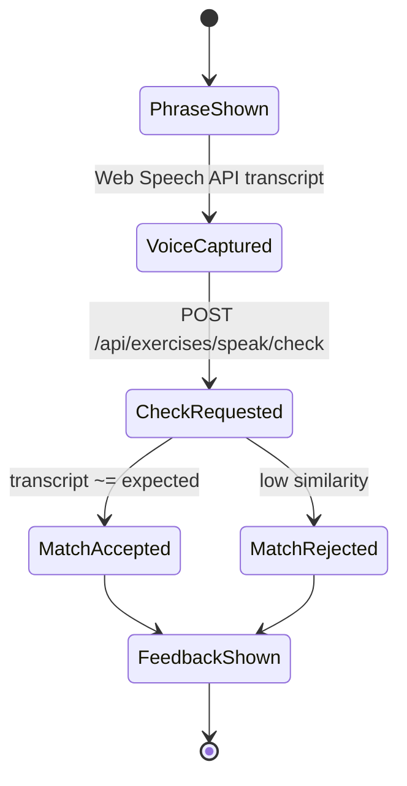

# FR-022 ? Проверка произношения (Web Speech API + server check)

Simulation artifact based on state diagram from section 6.

## State Diagram

```mermaid
stateDiagram-v2
[*] --> PhraseShown
PhraseShown --> VoiceCaptured : Web Speech API transcript
VoiceCaptured --> CheckRequested : POST /api/exercises/speak/check
CheckRequested --> MatchAccepted : transcript ~= expected
CheckRequested --> MatchRejected : low similarity
MatchAccepted --> FeedbackShown
MatchRejected --> FeedbackShown
FeedbackShown --> [*]
```
