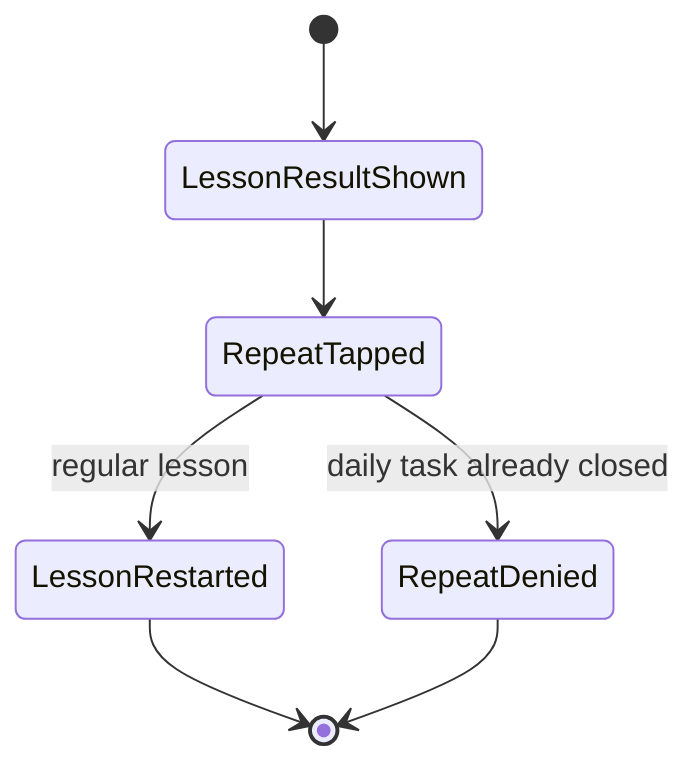

# FR-023 ? Повтор урока

Simulation artifact based on state diagram from section 6.

## State Diagram

```mermaid
stateDiagram-v2
[*] --> LessonResultShown
LessonResultShown --> RepeatTapped
RepeatTapped --> LessonRestarted : regular lesson
RepeatTapped --> RepeatDenied : daily task already closed
LessonRestarted --> [*]
RepeatDenied --> [*]
```
