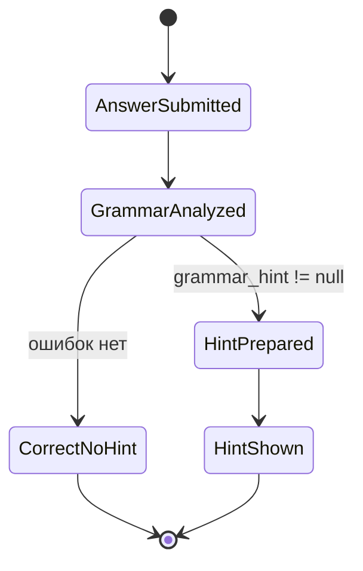

# FR-024 ? Грамматические подсказки

Simulation artifact based on state diagram from section 6.

## State Diagram

```mermaid
stateDiagram-v2
[*] --> AnswerSubmitted
AnswerSubmitted --> GrammarAnalyzed
GrammarAnalyzed --> CorrectNoHint : ошибок нет
GrammarAnalyzed --> HintPrepared : grammar_hint != null
HintPrepared --> HintShown
CorrectNoHint --> [*]
HintShown --> [*]
```
