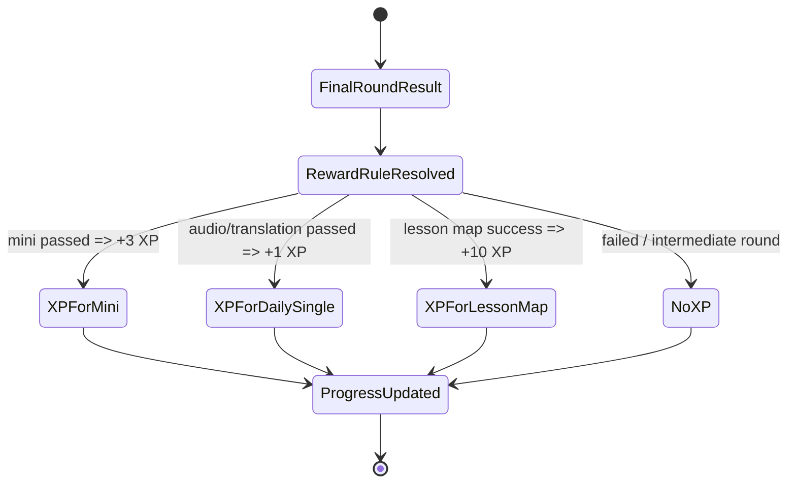

# FR-030 ? Начисление XP

Simulation artifact based on state diagram from section 6.

## State Diagram

```mermaid
stateDiagram-v2
[*] --> FinalRoundResult
FinalRoundResult --> RewardRuleResolved
RewardRuleResolved --> XPForMini : mini passed => +3 XP
RewardRuleResolved --> XPForDailySingle : audio/translation passed => +1 XP
RewardRuleResolved --> XPForLessonMap : lesson map success => +10 XP
RewardRuleResolved --> NoXP : failed / intermediate round
XPForMini --> ProgressUpdated
XPForDailySingle --> ProgressUpdated
XPForLessonMap --> ProgressUpdated
NoXP --> ProgressUpdated
ProgressUpdated --> [*]
```
