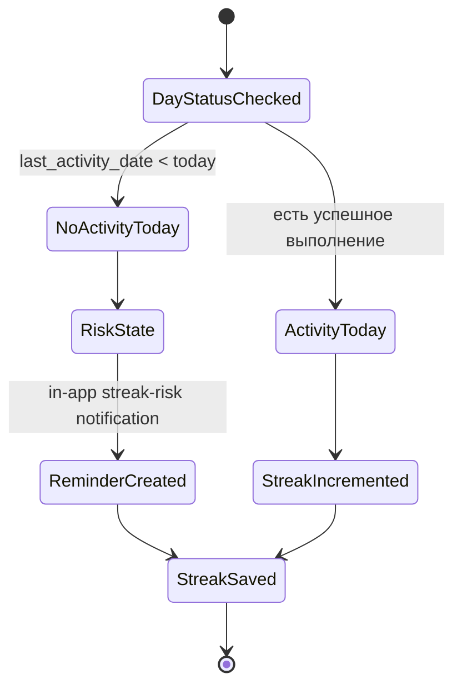

# FR-031 ? Отслеживание ежедневного стрика

Simulation artifact based on state diagram from section 6.

## State Diagram

```mermaid
stateDiagram-v2
[*] --> DayStatusChecked
DayStatusChecked --> ActivityToday : есть успешное выполнение
DayStatusChecked --> NoActivityToday : last_activity_date < today
ActivityToday --> StreakIncremented
NoActivityToday --> RiskState
RiskState --> ReminderCreated : in-app streak-risk notification
ReminderCreated --> StreakSaved
StreakIncremented --> StreakSaved
StreakSaved --> [*]
```
