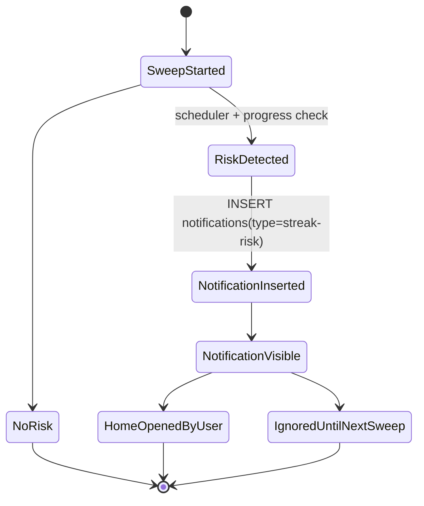

# FR-034 ? Уведомления о риске стрика (in-app)

Simulation artifact based on state diagram from section 6.

## State Diagram

```mermaid
stateDiagram-v2
[*] --> SweepStarted
SweepStarted --> RiskDetected : scheduler + progress check
SweepStarted --> NoRisk
RiskDetected --> NotificationInserted : INSERT notifications(type=streak-risk)
NotificationInserted --> NotificationVisible
NotificationVisible --> HomeOpenedByUser
NotificationVisible --> IgnoredUntilNextSweep
NoRisk --> [*]
HomeOpenedByUser --> [*]
IgnoredUntilNextSweep --> [*]
```
