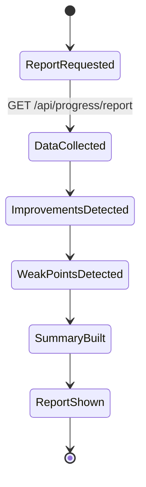

# FR-061 ? Краткий отчёт об улучшениях и слабых местах

Simulation artifact based on state diagram from section 6.

## State Diagram

```mermaid
stateDiagram-v2
[*] --> ReportRequested
ReportRequested --> DataCollected : GET /api/progress/report
DataCollected --> ImprovementsDetected
ImprovementsDetected --> WeakPointsDetected
WeakPointsDetected --> SummaryBuilt
SummaryBuilt --> ReportShown
ReportShown --> [*]
```
